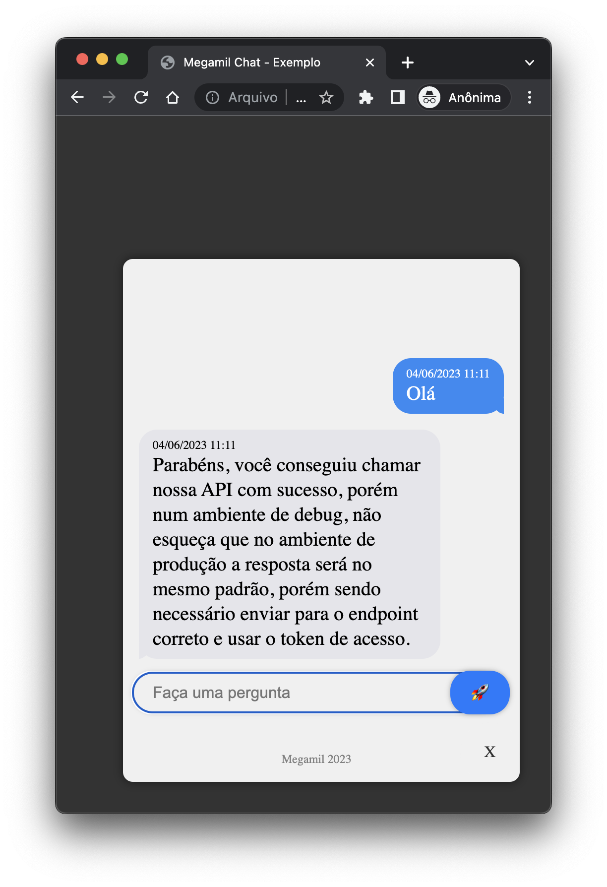

# Megamil SDK para Web

Bem-vindo ao Megamil SDK para Web, uma ferramenta poderosa para incorporar uma funcionalidade de chat em seu site. Este SDK foi desenvolvido para fornecer uma experiência de chat intuitiva e personalizável para os usuários do seu site.

## Instruções de Integração

Para integrar o Megamil SDK em seu site, siga estas simples instruções:

### Passo 1: Inclua os Arquivos CSS e JavaScript

Adicione os seguintes links ao cabeçalho do seu documento HTML:

```html
<link rel="stylesheet" href="https://cdn.rawgit.com/Megamil/megamil_sdk_answer_web/main/assets/megamil_sdk.css">
    <script src="https://cdn.rawgit.com/Megamil/megamil_sdk_answer_web/main/assets/megamil_sdk.js" 
      data-sdk="megamil" 
      data-sdk-token="SEU-TOKEN" 
      data-placeholder="Faça uma pergunta"
      data-error-message-default="Desculpe, tivemos um problema"
      data-unicode-icon-send="&#x1F680;"
      data-unicode-icon-open="&#x1F680;"
      data-unicode-icon-close="&#x58;"></script>
  </head>
```

Se preferir faço o download dos arquivos `megamil_sdk.css` e `megamil_sdk.js` em seu projeto e aponte para eles localmente, porém pode não estar sempre com a última atualização ativa.

### Passo 2: Configuração dos Atributos

Certifique-se de configurar os atributos necessários no script:

- `data-sdk`: **Não alterar** - Indica o SDK que está sendo utilizado.
- `data-sdk-token`: **Substituir com seu token** - Forneça seu token único para autenticação.
- `data-placeholder`: **Opcional** - Especifica o texto do espaço reservado no campo de texto do chat.
- `data-error-message-default`: **Opcional** - Define uma mensagem padrão em caso de erros.
- `data-unicode-icon-send`: **Opcional** - Código Unicode para o ícone do botão de enviar.
- `data-unicode-icon-open`: **Opcional** - Código Unicode para o ícone do botão de abrir o chat.
- `data-unicode-icon-close`: **Opcional** - Código Unicode para o ícone do botão de fechar o chat.

### Passo 3: Aproveite o Chat!

Com esses passos simples, você terá uma experiência de chat totalmente funcional em seu site, proporcionando uma interação eficaz com os visitantes.

## Resultado
<div style="overflow: hidden; white-space: nowrap;">
    
</div>